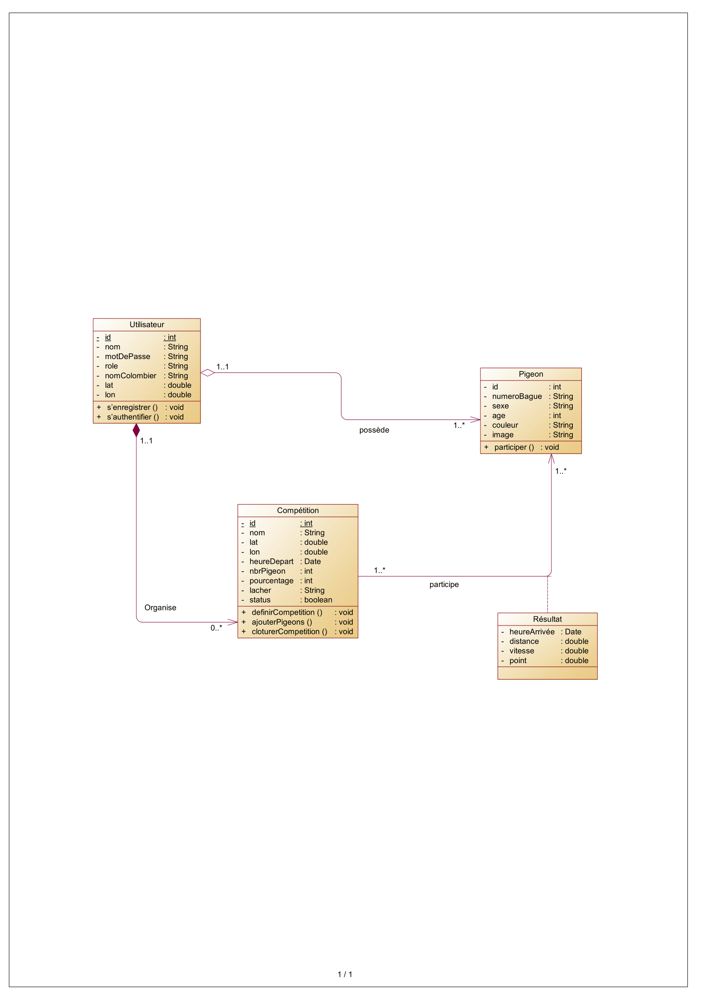

# Gestion des Compétitions de Pigeons Voyageurs 🕊️

Ce projet est une application API développée dans le cadre d’une compétition annuelle organisée par la **Fédération Marocaine des Pigeons Voyageurs**. Elle vise à simplifier et automatiser la gestion des compétitions, de l’enregistrement des éleveurs à la publication des résultats.

## Table des Matières
- [Description](#description)
- [Fonctionnalités](#fonctionnalités)
- [Architecture](#architecture)
- [Diagramme UML](#diagramme-uml)
- [Règles de Calcul des Résultats](#règles-de-calcul-des-résultats)
- [Exigences Techniques](#exigences-techniques)
- [Installation](#installation)
- [Usage](#usage)
- [Tests](#tests)

---

## Description
La compétition annuelle implique plusieurs éleveurs et pigeons. Elle se divise en trois étapes principales : 
1. **Vitesse**
2. **Demi-fond**
3. **Fond**

L’application permet de :
- Gérer les éleveurs et leurs pigeons
- Configurer les compétitions
- Collecter et calculer les résultats
- Publier des classements et des performances globales

---

## Fonctionnalités
### Pour les éleveurs :
- Enregistrement et authentification
- Ajout de pigeons pour la saison active
- Consultation des résultats et export en PDF

### Pour les organisateurs :
- Définition des compétitions (point de lâcher, distance prévisionnelle, etc.)
- Ajout des pigeons participants
- Upload des données collectées après une course
- Clôture des compétitions et calcul automatique des résultats

### Affichage des Résultats :
- Classement des pigeons pour chaque compétition
- Classement général basé sur le cumul des points
- Export des résultats en PDF

---

## Architecture
L’application est organisée en plusieurs couches :
1. **Controller** : Gestion des requêtes HTTP
2. **Service** : Logique métier
3. **Repository** : Interaction avec la base de données MongoDB
4. **Model** : Représentation des entités

---

## Diagramme UML

Le diagramme UML des classes représente les principales entités et leurs relations dans l’application.



- **Entités principales** :
  - `User` : Gestion des utilisateurs (éleveurs et organisateurs)
  - `Pigeon` : Informations sur chaque pigeon
  - `Competition` : Détails des compétitions
  - `Result` : Calculs et stockage des résultats
- **Relations** :
  - Un `User` possède plusieurs `Pigeons`
  - Une `Competition` est liée à plusieurs `Results`
  - Un `Result` associe un `Pigeon` à une `Competition`

---

## Règles de Calcul des Résultats
### Collecte des Données
- Upload des heures d’arrivée et des numéros de bague des pigeons.

### Calcul des Données
1. **Distance** : Utilisation de la formule de Haversine.
2. **Temps de Vol** : Différence entre l’heure de départ et l’heure d’arrivée.
3. **Vitesse** : `vitesse = distance / temps`
4. **Ajustement de la Vitesse** :  
   - Coefficient = `distance moyenne / distance parcourue par le pigeon`
   - Vitesse ajustée = `vitesse x coefficient`

### Classement et Points
- Les pigeons sont classés par vitesse ajustée.
- Attribution des points en fonction du classement.
- Calcul du classement général par cumul des points des 5 meilleurs pigeons par éleveur.

---

## Exigences Techniques
- **Framework** : Spring Boot
- **Base de Données** : MongoDB
- **Validation** : Validation des données et gestion centralisée des exceptions.
- **Tests** : Tests unitaires pour les services.
- **Fichier de Configuration** : Utilisation de YAML.

---

## Installation
1. Clonez le dépôt :
   ```bash
   git clone https://github.com/kholoud001/PigeonSkyRace.git
   
